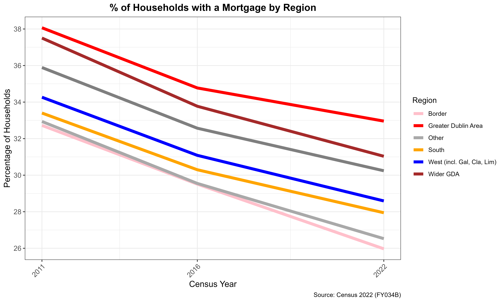
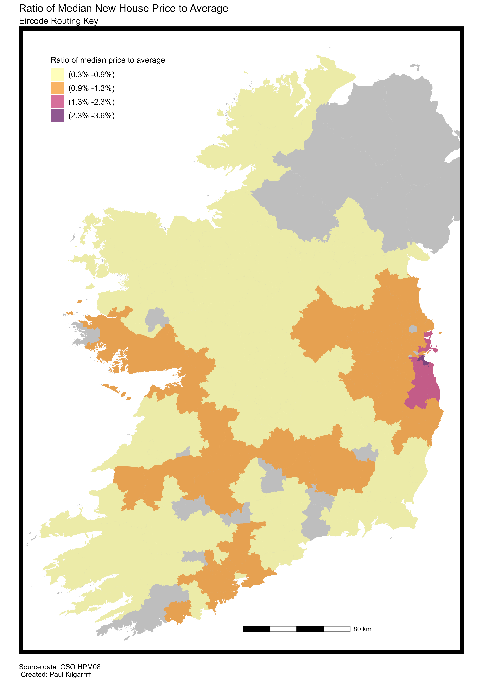

```{r setup, include=FALSE, warning=FALSE, cache.comments=FALSE, message=FALSE, results=FALSE}
knitr::opts_chunk$set(echo = TRUE)
```

## Plotting Data

In this section we examine some of the trends from the recent census results.

```{r Census 2022, echo=FALSE, out.width="80%",fig.align="center", fig.cap="Household Size by GDA local authority"}
#Create plot of average household size by Greater Dublin Area local authority

```

The figure shows that household size has remained almost unchanged since 2016. The trend between 2011 and 2016 of an increasing household size has stopped.

```{r Census 2022 Mortgage, echo=FALSE, out.width="80%",fig.align="center", fig.cap="% of households with a mortgage"}
#Create plot of average household size by Greater Dublin Area local authority
#This takes a while to run as it downloads data

```
Percentage of households with a mortgage has declined since the peak in 2006. Rates in 2022 were lower compared to rates in 2002. 

```{r Census 2022 Tenure, echo=FALSE,out.width="80%", fig.align="center",fig.cap="Housing Tenure by Census"}
#Create plot of household tenure in 2022

```
A look at overall tenure shows that those who had a mortgage previously were not replaced once they moved into the own outright category. The largest absolute change was in the social housing category.

```{r Map of House Prices, echo=FALSE,out.width="160%",fig.align="center", fig.cap="Ratio of median price to national median"}
#Create map of median new house price (12 month rolling median) at the Eircode Routing Key level and show as a ratio to national median.


```

One potential hypothesis for the declining levels of mortgages is the viability of new housing reducing the level of new supply and as a result mortgages drawn down decrease. This is despite medium to high levels of demand. House prices are determined not only by the physical characteristics of the property, but also environmental attributes such as the strength of the local labour market (determining income), life outcomes (socio-demographics of the area) and the amenities in the area. In cases where viability is low, 100% LTV may not even cover the construction costs of a new property.

